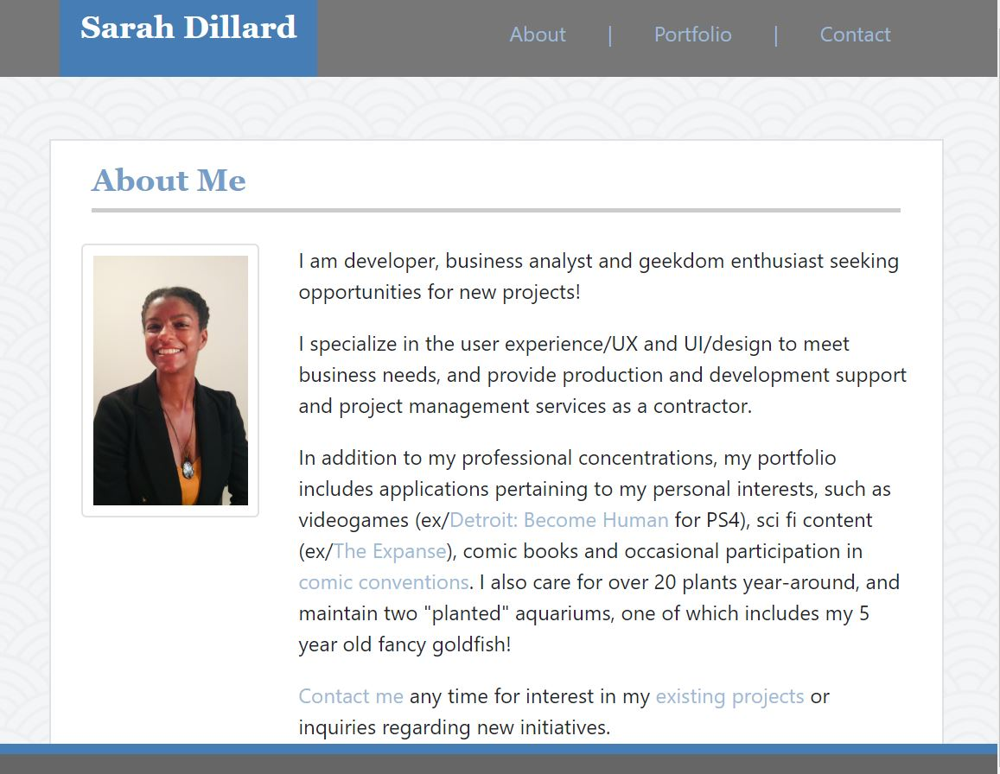

# porfolio-scd-homework2
This is a repository for the NU Coding Bootcamp Homework 2, responsive portfolio.

## Purpose

This is a GitHub repository for my second developer portfolio. Introduces a short bio, developer projects and contact information. This second porfolio uses Bootstrap for responsive design.

## Screenshot of Completed Application

## GitHub Pages Link

https://gideonrynn.github.io/portfolio-gideonrynn-array/

## Installation

With GitHub account, clone or download repository using link. 

## Usage

For the purpose of showcasing developer projects for S. Dillard (2019).

Profile contains index.html, portfolio.html, and contact.html. Portfolio contains built in cards within columns that can be duplicated to add more project images and links.

## License

   This page uses the MIT License: https://choosealicense.com/licenses/mit/.